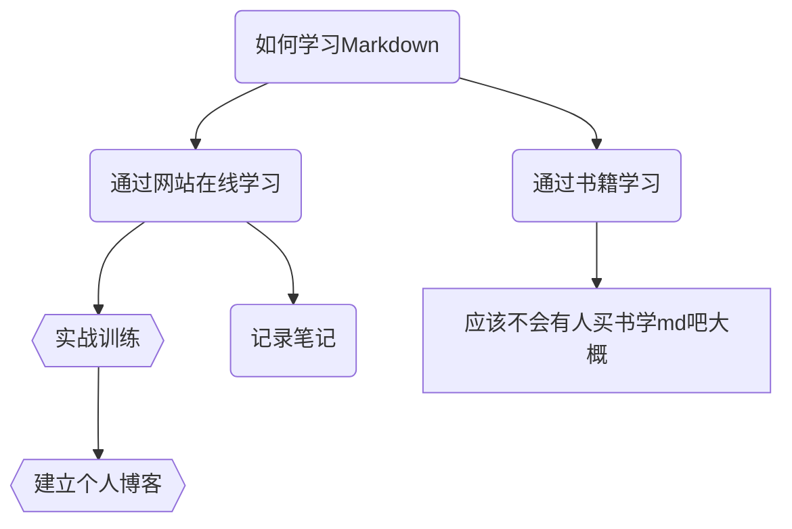

# 目录

- [很高兴能来参加升华工作室程序部二面！](#%E5%BE%88%E9%AB%98%E5%85%B4%E8%83%BD%E6%9D%A5%E5%8F%82%E5%8A%A0%E5%8D%87%E5%8D%8E%E5%B7%A5%E4%BD%9C%E5%AE%A4%E7%A8%8B%E5%BA%8F%E9%83%A8%E4%BA%8C%E9%9D%A2%EF%BC%81)
  * [学习git的过程](#%E5%AD%A6%E4%B9%A0git%E7%9A%84%E8%BF%87%E7%A8%8B)
    + [经历](%E7%BB%8F%E5%8E%86)
    + [实践](#%E5%AE%9E%E8%B7%B5)
  * [学习Markdown的过程](#%E5%AD%A6%E4%B9%A0Markdown%E7%9A%84%E8%BF%87%E7%A8%8B)
  * [学习Markdown的实践](#%E5%AD%A6%E4%B9%A0Markdown%E7%9A%84%E5%AE%9E%E8%B7%B5)
  * [进入程序部之后想学习的东西](#%E8%BF%9B%E5%85%A5%E7%A8%8B%E5%BA%8F%E9%83%A8%E4%B9%8B%E5%90%8E%E6%83%B3%E5%AD%A6%E4%B9%A0%E7%9A%84%E4%B8%9C%E8%A5%BF)
  * [结语](#%E7%BB%93%E8%AF%AD)

------

# 很高兴能来参加升华工作室程序部二面！

## 学习git的过程
### 经历

　　因为我原本就很喜欢搞一些电脑软件技术之类的东西，所以能经常接触`Github`这样一个开源代码管理平台。但是说来惭愧，用了这么久的`Github`，直到二面要求后，我才开始着手学习git本体，也才对git有了些初步的了解😂

　　我是在学长们推荐的[廖雪峰老师的网站](https://www.liaoxuefeng.com/wiki/896043488029600)上学习git的，廖雪峰老师的python教学我以前有学习过一段时间，最吸引我的是他**语言之幽默，课程之简洁，不拖泥带水**，仅用文字与图片就能实现视频学习的效果。我很快就学会了git的一些基本命令,还记下了笔记以便日后复习：

```bash
git init #把目录转换为仓库 
git add _NAME_ #添加想要commit的文件
git commit -m "text"
git status #查看工作目录里的修改
git diff #查看修改的内容
git log #查看日志 --pretty=oneline 一行输出一个commit
git reset --hard <commit> #HEAD表示当前版本 HEAD^表示上个版本 ^^上上个 ~n 前n个版本
git checkout -- <file>  / git restore <file>
git restore --staged <file>
git restore <file>
git remote add origin git@github.com:<remotesshname>
git push -u origin master
...
```

除指令以外，还学习了分支管理的内容如

- 创建与合并分支 `git switch -c` `git merge`
- 解决分支间冲突
- Fast-Forward合并与普通合并的区别
  - --no-ff 普通合并 合并后历史有分支 能看出来曾今做过合并
  - fast-forward 快速合并 速度快但是不能看出曾经做过合并
- 为修复Bug进行分支
- 添加功能进行分支
- 远程库推送push/拉取pull分支
  - 在本地创建和远程分支对应的分支 `git checkout -b branch-name remote-name/branch-name`
  - 建立本地分支和远程分支的关联 `git branch --set-upstream branch-name remote-name/branch-name`

还有tag标签功能、自定义git、自定义bash外观等等操作。

　　**但是**在学习git的过程中，最让我感到困惑的就是Rebase这个操作具体是怎么使用的，现阶段我还没有与他人远程协作过，不太了解它的重要性，这一点我想在今后与他人合作中进一步学习。

### 实践

　　惭愧的是，我能力还不足以完成一个程序项目，所以git实战经验还是几乎为零，但我相信在今后学习各种编程语言，尝试做出自己的项目时，git将会派上大用场。

## 学习Markdown的过程

其实我对Markdown并不陌生。

我曾经搭建过自己的[个人博客](http://frnks.top/)，写博客就是用的Markdown~ ~~(只不过我已经好久没更新过博客了，里面也没有什么有技术含量的东西，纯属搭着玩的)~~

有了些基础后，复习就简单了许多，看到二面的题目后，我马上就打开尘封已久的Typora🤣回顾自己写过的博客，很快就熟练了

## 学习Markdown的实践

我觉得这个`README.md`应该也算是一种实践吧

或者说可以去看看我的[博客](http://frnks.top/) 虽然以前写的有点简陋（

这里就来个mermaid流程图8



[^Mermaid官方文档]: https://mermaid-js.github.io/mermaid/#/
[^Mermaid Github]: https://github.com/knsv/mermaid

## 进入程序部之后想学习的东西

作为一个爱折腾的人，我想学的东西非常之多：

1. 学习如何团队协作，共同开发项目/维护项目

2. 精通至少一门除C以外的编程语言如

    |   语言   | 原因                                                         |
    | ---- | ---- |
    | Java | 我对Minecraft的模组很感兴趣，也想自己上手写一个<br />（而且我也想试试安卓开发） |
    | Javascript | 我很想学习前端三件套js/css/html 还想自己写脚本 满足自己的一些需求 |
    | Python | 之前学过一点，主要是语法简单，而且有现成的深度学习库 |

3. 挺想学习一下人工智能深度学习之类的内容，觉得这些真的挺神奇的

4. 与程序部的大家畅聊最新前沿技术

## 结语

感谢您能抽空阅读！

写完了才发现Github的Markdown预览似乎不支持mermaid...总之在Typora里可以看到啦🤗

