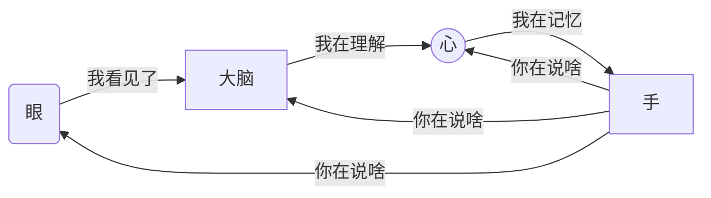
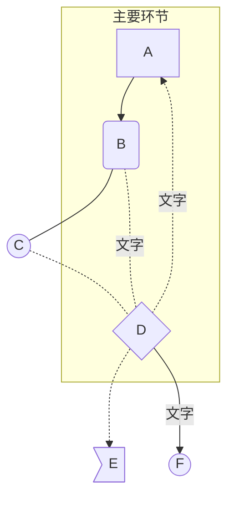

# 二面任务一

## 第一部分：学习markdown

### 额，对，我是先学的Markdown，~~因为git看起来就难搞~~，但其实Markdown也***没有那么简单***

#### 军训时学习状态并不好，~~负责人忙不完的事~~，终于到了国庆，==开冲！！！==

:dog::dog::dog: 

 


| 日期 | 十月二号 | 十月三号    |
| ---- | -------- | ----------- |
| 上午 | 找教程   | 看教程+实践 |
| 下午 | 看教程   | 复习？？？  |

### 诗人周国平曾经说

> 打败人的，不是困难，而是无知中的不知所措 

### 所以尽管有点困难，但我还是坚持了下来 

:smile::smile::smile:

### 教程主要来自于[哔哩哔哩](https://www.bilibili.com/video/BV1C7411V7SF?spm_id_from=333.999.0.0),我可没白嫖QAQ

### <u>其余成果展示会在第三部分出现，还请稍安勿躁</u>

***

## 第二部分：学习git

### 经历了Markdown的洗礼，我又有了一些蜜汁自信,但是事实。。。

### 


### 下载git 注册github没

### 什么难度，但是之后的一些概念直接把我整蒙圈了

:dizzy::dizzy::dizzy::dizzy::dizzy:

### 好不容易概念整明白点，git指令也学会了一些，远程库的和本地库的连接又不会了

### 总滴来说就是




## ==简直离谱==

### 后来请教了学长，搞了ssh，重新建了一个远程库，我又开始git push，却


### 按给出的指令继续，还是不行


### 但是现在既然能看见，那么说明我还是成功了对不对


### 教程同样来自于[哔哩哔哩](https://www.bilibili.com/video/BV1e541137Tc?spm_id_from=333.999.0.0)和[哔哩哔哩](https://www.bilibili.com/video/BV1Xx411m7kn?spm_id_from=333.999.0.0)

*********

##  第三部分：Markdown展示

### #字加空格代表级数，有几个#就是第几级 ~~文字~~ *文字*  **文字**

### ***文字*** <u>下划线</u>

### 下标 C~2~H~5~OH   AL(OH)~3~           上标 m^2^ m^3^ a^e^ 

### 表情 :small_orange_diamond: :crescent_moon: :crying_cat_face: :fuelpump: :sailboat: :first_quarter_moon: :walking_woman: :ear_of_rice: :rabbit: 

### 引用  

> ### 想引用的话 

### 表格 

|      |      |      |
| ---- | ---- | ---- |
|      |      |      |
|      |      |      |

* 无序列表
* 无序

1. 有序列表
2. 有序

### 代码块

```java
public
```

### 自动连接

<https://www.bilibili.com/video/BV1Cf4y127iq?spm_id_from=333.999.0.0>   

### 就是需要按了ctrl再点。。。

### 网址

[罗翔](https://www.bilibili.com/video/BV1pz4y1Q7p2?from=search&seid=12078433478029542172&spm_id_from=333.337.0.0)

### 图片（那就来张二次元吧）


### 流程图



### 序列图

```mermaid
sequenceDiagram
Title:序列图
participant s as 售货员
participant b as 买家
Note right of b:饱受高考欺压的高三人
Note left of s:人类高质量售货员
b->>s:衬衫的价格是多少？
s-->>b:九磅十五便士
b->>s:拜拜了您内
s-->>b:我们这还有别的
b->>+s:给我来件新的
s-->>-b:好嘞找到了
loop 刁难人
b->>s:这件不行，再找
s-->>b:好的好的，顾客是上帝
end
alt 找了十几次后
s-->>b:这位顾客你违反了中华人民劳动法
end
par
b->>s:别整这有的没的
and
b->>s:我也是被逼的
end
s-->>b:那你到底买不买？
b->>s:买，只要不是九磅十五便士
```


***

## 第四部分：我想要获得的提升

### 因为我是纯小白。。不像有些人说自己是小白，实际背地里早就翻过c++啥的。

## Python    Java（有点老了？）   c++（不知道用不用得上）

## They who know the truth are not equal to those who love it ,and they who love it are not equal to those who delight in it


