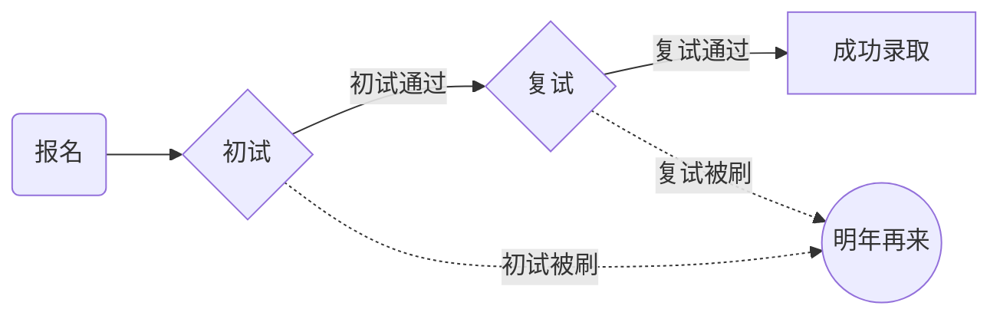
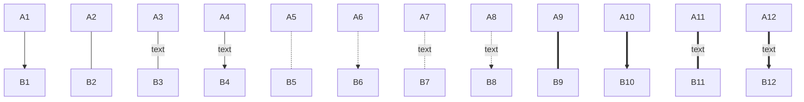
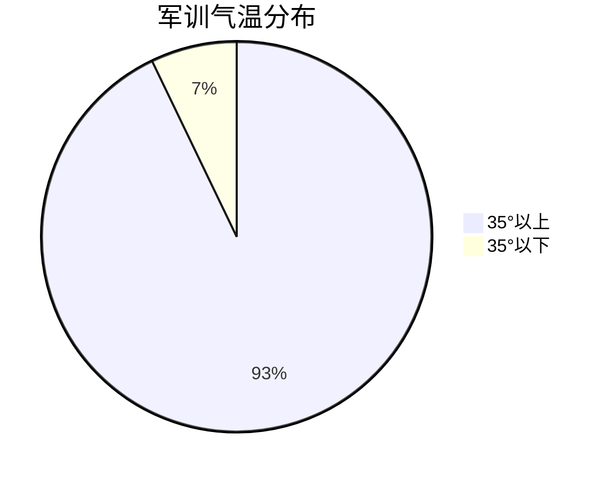

# =MarkDown学习过程及实践

去掉严格模式+扩展语法+重启

## 标题

*一级标题前使用一个#*

*二级标题前使用两个# 以此类推*

## 文字编辑

**加粗** 文字两侧各加两个*

*斜体*  文字两侧各加一个*

***加粗+斜体***  文字两侧各加三个*

**下划线**   <u>快捷键</u>(ctrl+u)

==高亮==  文字两侧各加两个==

下标O~2~  文字两侧各加一个~

上标2^2^ 文字两侧各加一个^

**表情** :+单词 例：  :+smile=:smile:

## 图表

**有序列表**  数字+.+空格

1. 哈哈哈
2. 嘻嘻嘻
3. 

**无序列表** 符号( +/*/-)+空格

+ 略略略
+ 哼

两次回车退出列表

**markdown中图为一段代码**

**流程图（graph)**

| 表述       | 效果           |
| ---------- | -------------- |
| id[文字]   | 矩形节点       |
| id(文字)   | 圆角矩形节点   |
| id((文字)) | 圆形节点       |
| id{文字}   | 菱形节点       |
| id>文字]   | 右向旗帜状节点 |

​                     **连线**

**饼图(pie)**

**链接**:  <网址>

**网上图片**：插入图片后输入网址

# git学习过程

**版本管理及代码上传**

git init 进入文件

git add 将文件状态转变为 staged   

git status 查看文件状态 

git commit 将文件同步到库中

git push 到远程仓库

远程到本地：pull clone checkout

ssh (配置了后感觉它跟我的任务关系不大，没它一样可以呀)

# 进入程序部后想学的东西

+ **做项目的具体流程及项目开发**
+ **Java python 等编程语言**
+ **大佬的思维方式**
+ **团队运转**

本人无转专业需求，想进程序部单纯是兴趣，想体验体验写代码的快乐！！!

